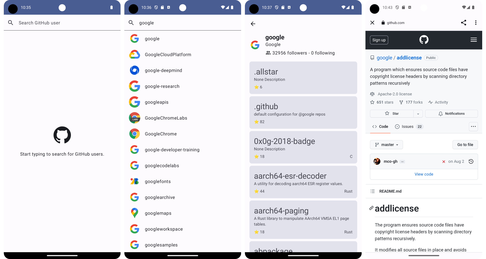
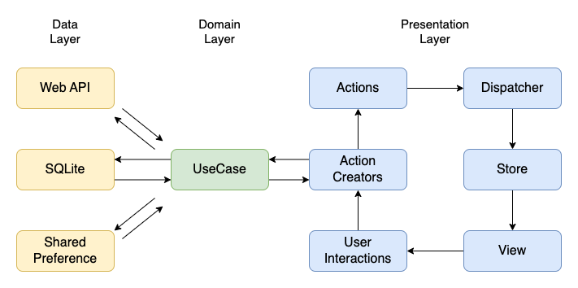

## Compose Architecture Sample

### GitHub User Explorer - A Jetpack Compose Flux Architecture Sample App

Explore the world of GitHub with our user-friendly mobile application, crafted with the modern Jetpack Compose framework and the efficient Flux architecture. This sample app demonstrates a seamless user experience for discovering and engaging with GitHub users and their repositories.

## Environment

* IDE：Android Studio Hedgehog | 2023.1.1
* Kotlin：1.9.0
* Java：17
* Gradle：8.2
* minSdk：26
* targetSdk：34

## Screenshots



## Requirements

### GitHub API Key

This Compose Architecture Sample uses the GitHub API to fetch data. To use the API, you need to obtain a GitHub personal access token. Follow the GitHub Documentation for instructions on how to create a personal access token.

Once you have the token, add this line to the `~/.gradle/gradle.properties file`, either in your user home directory (usually ~/.gradle/gradle.properties on Linux and Mac) or in the project's root folder:

```
github_token=<YOUR-TOKEN>
```
The app is still usable without the API key, but you won't be able to access GitHub data.

## Architecture

The application leverages the Flux architecture to ensure a unidirectional data flow, enhancing the predictability and manageability of the state throughout the application. The architecture is divided into distinct layers, each with defined responsibilities, to promote separation of concerns and modular development.

### Flux Architecture



- **Action**: Indicates an intent to change the state within the app.
- **Dispatcher**: Processes actions and sends updates to the registered stores.
- **Store**: Holds the state and updates the UI components in response to changes.
- **View**: Displays the state from the stores and dispatches actions based on user interactions.

By adhering to these structural and architectural rules, the Jetpack Compose Flux sample app showcases a robust and scalable approach to Android app development, capitalizing on the reactive programming benefits of the Flux architecture.

### Key Components

#### Entry Points
- `MainActivity.kt` & `MainApplication.kt`: Serve as the application's launching points. The MainActivity is the primary UI container, while the MainApplication handles application-wide initializations.

#### /app Package
- `data`: Contains classes such as `ApiClient`, `AuthInterceptor`, and `GithubApiService` for managing network requests and responses.
- `di`: Houses dependency injection modules like `ApiModule`, `RepositoryModule`, and `UseCaseModule`, providing instances for data handling, action creation, and state dispatching.
- `module`: Includes `Action` and `ActionObserver` classes that define the actions to be dispatched and observed within the app.
- `ui`: Comprises UI components like `ErrorContent`, `ProgressIndicator`, and theming utilities to define the application's appearance.

#### /domain Package
- `search`: Contains the domain-specific logic for the GitHub user search feature, including data models, repositories, use cases, and UI components relevant to the search functionality.
- `userInfo`: Focused on user information, detailing data handling and UI rendering for GitHub user profiles and repository information.

### Package Reference Rules
The `app` package can utilize functionalities from the `domain` package but not the other way around. This ensures the domain layer's independence from the app-specific implementations, allowing for better reusability and testability. Each domain module like `search` and `userInfo` is self-contained with its own set of actions, dispatchers, stores, data models, repositories, and UI components.

## Function

### SearchScreen

#### Initial State

This initial screen is where users can start their search for GitHub users. It features a search bar at the top with the placeholder text "Search GitHub user." Below the search bar, there's a call to action, "Start typing to search for GitHub users." indicating that as the user types, search results will begin to populate.
Search Results Screen.

#### Searched State

After initiating a search, this screen displays a list of GitHub users that match the query. Each user is represented with their profile picture, username, and user's full name if available. The screen design uses a clean, card-based layout for each user, which provides a clear and organized way to present the list of search results.

### UserInfoScreen

Selecting a user from the search results brings up this detailed profile screen. It showcases the user's GitHub avatar, username, and a bio. Below the user information, there's a list of repositories with a brief description, the primary language of the repository, and the number of stars it has received. This screen provides an in-depth look at the user's contributions and projects on GitHub.
Repository Detail Screen.

### RepositoryScreen

This screen offers a detailed view of a specific GitHub repository. It includes the repository's name, the user or organization it belongs to, and a detailed description of the repository. There's information about the number of stars, forks, and the license under which the repository is released. Additionally, the screen includes options to star the repository, view the number of open issues, and access various repository sections such as the code, issues, and pull requests.